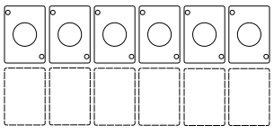
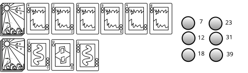
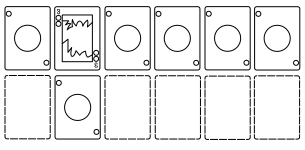
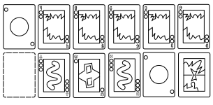
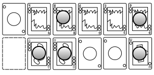
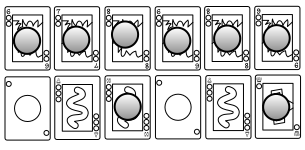

Oracles is my Soothsayers-like game for the Decktet.

## Requirements

* one deck(tet) per player
* a bank of suit tokens
* a supply of 18 of another color or type of token for victory points

## Setup

Set up the bank, including the victory points.  

Divide the Decktets into:

* Aces  (6 per player)
* Ranked cards (2--9) (24/48/72 cards)
* Crowns and extended deck cards. (15/30/45 cards)

Give one set of all six Aces to each player.  They lay them out in suit order to form their base tableau row.  They should also leave space below the aces for cards they will eventually capture (that is, add to the extended tableau row).

Shuffle the ranked cards to form the base deck.  Deal out six in the center of the table to form the base market.  Also deal four cards to each player.

Shuffle the remaining cards to form the extended deck.  Deal out three in the center of the table to form the extended market.

Optionally, set aside 6 victory tokens in a third market area and write down the prices:  7/12/18/23/31/39 (suit tokens).

The player who most recently consulted an oracle goes first.

## Goals 

### The Tableaux

Players' tableaux should be laid out and remain in suit order.  The main goal of the game is to build up your twelve tableau piles until you are ahead in enough of them to claim victory.  The uppermost card in each base pile determines your current power in that suit.  When building on a tableau pile, you must always match the original suit (the suit of the ace), even if the ace has been moved away, and increase in rank.  New cards are stacked on top of old ones.

When first ascending a base suit, the ace is moved down to the extended deck row, thus:

If you are the first player to ascend in that suit, also mark the moved ace with a victory point token. (See below.)

The extended tableau piles are ranked/filled in the order *Ace*, *Crown*, *Pawn*, *Court*, *Excuse*.  The Ace must be present to place a Crown (whether by capture or other means).  The base pile value must be greater than 3 to place a Pawn, greater than 5 to place a Court, and greater than 7 to place an Excuse.  You need not place a Crown before placing a Pawn or a Court, etc.  If for some reason you need to place an extended deck card of the same or lower rank onto an extended tableau pile, discard any intervening cards that are not in strictly ascending rank.

#### Victory Points for Piles

Whenever a player attains the highest current rank in a base or extended tableau suit, place a victory token on that card to mark it.  For mystical reasons, a victory token is also called a "third eye" or "eyeball."

Take the first eyeball of each pile from the bank, but afterwards take it from another player when *surpassing* them in rank for that tableau pile.  There should only ever be twelve eyeballs in use on the players' tableaux, one for each base tableau suit and one for each extended tableau suit.

Additional eyeballs may be bought using extended deck powers.  Keep these eyeballs separate to avoid confusion.

## Gameplay

Each suit has powers which vary according to the ranks of your base or extended tableau pile for that suit.  Generally speaking, these powers are:

1. **Moons**: add flexibility to lead/follow actions
2. **Suns**: draw cards from the base market or deck
3. **Leaves**: play cards from your hand to your base tableau piles
4. **Waves**: play cards from the extended market to your extended tableau piles
5. **Wyrms**: rearrange your tableaux or exchange suit tokens
6. **Knots**: earn suit tokens or buy victory points

This is a lead-follow type of game.  The first player leads, and all other players have the option to follow.  Only after all players have followed are the markets refilled from the corresponding decks.  When either deck is exhausted, you may shuffle the discards.  If ever you cannot refill the base deck market completely, the game ends immediately.

### Lead

The first player leads by declaring a card from their base tableau, and the suit it is on.

1. **Moons**:  When leading a ranked card on their Moons pile, the effect is to lead the other suit, at its Moon rank.
   (The ace of Moons may not be led; the first player will have to lead an ace of another suit).  
2. **Suns**: Draw (rank/2 + 1) cards from the base market or base deck.  (Shuffle base discards when necessary.)
3. **Leaves**: Ascend (rank + rank/3 + 2) levels in any combination of suits.  Skipping a rank costs one of your Ascend actions each, and only (rank/4 + 1) ranks may be skipped.
4. **Waves**: Capture (rank/4 + 1) extended deck cards using tokens and (rank) base cards.  You must match at least min((3 - rank/3), suits) of the target card's suits with each card, and with the sum of your spent tokens.  *All* tokens must match the captured card's suit(s).
5. **Wyrms**: Rearrange, depending on the second suit:
   * Moons: choose one of the other 5 suits and perform its action (*this combination does not occur in the base deck*)
   * Suns:  discard (rank/2 + 1) cards from the market
   * Leaves: move (rank/2 + 1) cards around your base tableau
   * Waves: discard (rank/3 + 1) cards from the extended market, or move (rank/3 + 1) cards around your extended tableau
   * Wyrms: take up to (rank/3 + 2) cards from your base tableau into your hand
   * Knots: exchange (rank) suit tokens 
6. **Knots**: Earn (rank/2 + 4) knots and/or the other suit token, in any combination.

### Follow

A player may follow if: 

* They have a card of the same or higher rank, on the same suit of their tableau.
* They have a card of lower rank, on the same suit of their tableau, **and** pay the leader the difference in suit tokens *matching* the led suit.
* They have a Moon of any rank that shares the led suit, and pay the leader the difference in suit tokens if their own rank is lower.  In this case they may pay in any combination of Moons tokens and tokens of the matching suit.

Otherwise, they pass and earn (rank/4 + 1) suit tokens of the led suit.

Follow powers are:

1. **Moons**: When Moons are "led", a follower may follow the leader's other Moons suit, at the leader's Moons rank, the follower's other Moons suit, as if it were led at the leader's Moons rank, or the *other* suit on the follower's top card of the led suit.
2. **Suns**: Draw (rank/3 + 1) cards from the base market or base deck.
3. **Leaves**: Ascend (rank + rank/3) levels in any combination of suits.  Skipping a rank costs one of your Ascend actions each, and only (rank/4 + 1) ranks may be skipped.
4. **Waves**: Capture (rank/5 + 1) extended deck cards using tokens and (rank/2 + 1) base cards.  You must match at least min((3 - rank/4), suits) of the target card's suits with each card, and with the sum of your spent tokens.  *All* tokens must match the captured card's suit(s).
5. **Wyrms**: Rearrange, depending on the second suit:
   * Moons: choose one of the other 5 suits and perform its action (*this combination does not occur in the base deck*)
   * Suns:  discard (rank/3 + 1) cards from the base market.
   * Leaves: move (rank/3 + 1) cards around your base tableau.
   * Waves: move (rank/4 + 1) cards around your extended tableau.
   * Wyrms: take up to (rank/4 + 1) cards from your base tableau into your hand
   * Knots: exchange (rank/2 + 1) suit tokens for other suits
6. **Knots**: Earn (rank/2 + 1) knot and (rank/2 + 1) of the other suit token.

Note that passing is different from following the Knots suit.

### Extended Powers

Prices for extended deck cards are: 10 for a Crown, 11 for a Pawn, 12 for a Court, and 13 for an Excuse.
The rank order for extended tableau piles is *Ace*, *Crown*, *Pawn*, *Court*, *Excuse*.

The extended deck powers are derived in a regular way from the following list:

* Moons: collect 2 more suit tokens from followers when leading a matching suit, or pay 1 suit token less when following a matching suit
* Suns: draw 2 extra cards when leading and 1 extra when following Suns
* Leaves: ascend 2 extra levels when leading and 1 extra when following Leaves
* Waves: use 2 extra base cards on capture when leading and 1 extra when following Waves
* Wyrms: rearrange 2 extra cards or suit tokens when leading and 1 extra when following Wyrms; **or** when leading or following *any* suit, you may perform that suit's Wyrms action on 2 cards or tokens when leading and 1 card or token when following
* Knots: earn 2 extra suit tokens when leading or 1 extra when following Knots, **or** when buying an eyeball from the eyeball market get a discount of 2 tokens when leading or 1 token when following (note that this is the only way to buy an eyeball on a follow)

Aces provide no extended deck powers.

#### Crowns

Crowns provide only the follow power for its suit from the list above.

#### Pawns

Pawns provide lead and follow powers for the tableau suit the Pawn is on, and follow powers for the Pawn's other two suits.
When leading or following the tableau suit the Pawn is on, you may consider the Pawn's additional suits as if they were on your base card.

* **the Watchman** (Moons, Wyrms, Knots)
* **the Harvest** (Moons, Suns, Leaves)
* **the Light Keeper** (Suns, Waves, Knots)
* **the Borderland** (Waves, Leaves, Wyrms)

#### Courts

Courts provide lead and follow powers for the tableau suit the Court is on, and for the Court's other two suits.
When leading or following any of the Court's suits, you may consider the Court's additional suits as if they were on your base card.

* **the Window** (Suns, Leaves, Knots)
* **the Island** (Suns, Waves, Wyrms)
* **the Consul** (Moons, Waves, Knots)
* **the Rite** (Moons, Leaves, Wyrms)

#### The Excuse

The Excuse provides lead and follow powers for the tableau suit the Excuse is on, and these powers are increased by one card, token, or level.
(For Knots, only the discount on eyeballs is increased; you may not buy extra eyeballs using this power.)
If the extended suit power required suit matching, that matching is no longer required.

### Endgame

A player wins immediately if they have eyeballs on all six base deck tableau piles, all six extended deck piles, or if they have (12 - playerCount) eyeballs total.

Otherwise, the game ends when the base market cannot be refilled.  In that case, the first tiebreaker is remaining suit tokens.  The second tiebreaker is highest level of extended deck tableau cards (the most Crowns, then the most Courts, then the most Pawns, then the most Aces).  If there is still a tie, do likewise with the base tableau levels.

## Solo/Bot

The solo game uses a bot and a suit die (or a plain d6; 1 = Moons, 2 = Suns, etc.) to simulate a second player.  You may also use the bot as an additional player in a multiplayer game.

The bot follows all the rules of the game, with the following exceptions:

1. The bot goes first.
2. The bot chooses which suit to lead using the suit die.  If it rolls a suit where it does nothing on lead, the other players may still follow.  In any other case where the bot needs to choose a suit, also use a suit die.
3. The bot pays the normal price to follow.  It follows whenever it can afford to, even if it cannot actually perform the follow action (see below).
4. The per-suit bot exceptions are:
  * **Moons**: The bot leads or follows its secondary suit, if present.
  * **Suns**: When drawing cards from the base market, the bot takes cards in order.  If the base market is or becomes empty, it draws any remaining cards from the base deck.
  * **Leaves**: The bot also draws cards from the base market in order to ascend.  First, it draws any single-level ascends it can perform, going in order across the market.  Next, *if* it has more than one ascend remaining, it draws any two-level ascends, and so on as long as it has any ascends remaining.  If the base market is or becomes empty, *and* it has ascends remaining, it may draw cards from the top of the base deck until it finds one it can ascend using its remaining budget.  It may repeat this action as long as its remaining budget after an ascend from the deck is *larger* than what it spent on the previous ascend from the deck.  Any card it draws and does not use is discarded.
  * **Waves**: The bot does not pay to capture extended deck cards; it captures as many as permitted by its current base Waves level.  If the extended market is empty, the bot does not capture any cardss.  Otherwise, it *must* take and play extended market card(s), in order.  A card taken by the bot is played on the first pile where it legally increases the level.  If there is no such pile matching the card, it is placed in the first matching suit pile In suit order, even if that means going down more levels than a later placement would.  If the placement is completely illegal (the bot has no ace yet), the card is discarded; it still counts as one of the bot's permitted captures.
  * **Wyrms**: The bot never uses Wyrms powers.
  * **Knots**: The bot always buys an eyeball, when the rules allow it to *and* it can afford to.

Note that the bot consumes the base deck and may end the game that way.

## Notes

Some suits do not appear together on basic Decktet cards:  suns with leaves, moons with wyrms, and waves with knots.  The other 12 two-suit combinations vary in frequency.

An Oracle deck is a more freeform, and generally smaller, divination deck than a traditional Tarot deck.

### Credits 

This game is based on [Soothsayers](https://boardgamegeek.com/boardgame/441114/soothsayers), an original card game by Jeff Grisenthwaite based partly on a traditional Tarot deck.  The bot is based on [my solo mode/bot for Soothsayers](http://mcdemarco.net/blog/2026/02/24/solo-soothsayers/).
