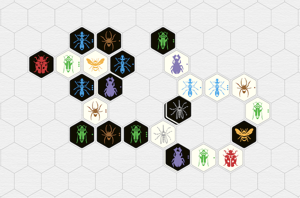
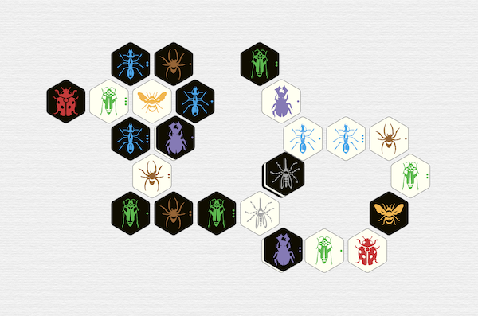

It seems you can't swing a cat without hitting a new notation system for Hive.  Tracking them all down is a bit more difficult, so I've attempted to catalog them here, including my own.  Where systems did not already have a name or a nickname, I also nicknamed them for clarity.

[](https://xkcd.com/927)

There are two major categories of notation systems for Hive, relative and grid-based, and two major goals, identifying a particular piece, and identifying a particular location.  Sometimes there is a third goal of identifying the type of move.  Sometimes there is a third type of notation aimed at documenting the entire board state (position) rather than the individual moves of a game.

The single universal of Hive notation may be the bug initials: **Q**ueen, **A**nt, **B**eetle, **G**rasshopper, **S**pider, **P**illbug, **L**adybug, and **M**osquito.  Most systems prefix bug initials by **w** or **b** for white and black, respectively, but a few use case, turn order, or other methods to track piece color.

Some systems make special use of the *Starting Axis*, which is a line drawn through the first two bugs played (perpendicular to their shared side).

Expansion pieces aren't always mentioned but it's usually clear how you would handle them, most notably by logging the pillbug's special ability as a move of the moved piece.

<div id="hiveTOC">!TOC</div>

# Relative Notation

At first I thought it was the dyslexic challenge of all the slashes in the standard notation that bothered me, but lately I've come to believe that my real issue with all relative notation systems is the need to scan the board for a (usually unrelated) neighboring bug *for every single move*.  I find the overhead of bug search (compared to, say, locating a place in a virtual grid) wearying.  

Another downside of most (but not all) relative notational systems is the additional overhead of numbering all your ants, beetles, grasshoppers, and spiders, usually by their order of entry into the game.  People *mark up their tiles* to do this.  (You might say that the computer will handle this for you in most situations, but then the computer could also handle grid-based notation for you.)

All other positional systems attempt to correct *other* perceived flaws of the standard system, so that's a good place to start.  After that, I've tried to order the systems by similarity, not date.  I also try to evaluate how the system does on some common pros and cons; I include a so-so's category because one player's pros can be another player's cons.

There are two subcategories of relative notation: systems that use a single reference bug to specify a location, and those that use multiple reference bugs.

## Single Bug Systems

### Standard Notation (ddyer)

The most popular notation system for Hive has its origins at [Boardspace.net](https://www.boardspace.net/english/about_hive_notation.html), the erstwhile go-to server for playing Hive online, and its programmer, Dave Dyer.  It is sometimes referred to as Boardspace or BS Notation.  You can read a full description at  [BoardGameGeek](https://boardgamegeek.com/thread/1070444/hive-notation-system-as-used-on-boardspacenet) or at [entomology](https://entomology.gitlab.io/notation.html).

In brief, pieces are called out by player color, bug initial, and, where necessary, order of entry into the game for duplicate bugs, *e.g.*, **wQ** or **bG2**.
Not that at Boardspace the tiles are rotated to track entry order, but at other sites or in live games they are either marked with one, two, or three dots, or left as-is.

Placements are called out with a reference bug plus a location bordering that bug, indicated by slashes or dashes.  Note that in this system, the bug is assumed to be in the pointy direction, which is to say that two of the points of the hexagon are pointing toward and away from the user, or up and down on a computer screen.

```
  \wQ  wQ/
  
-wQ  wQ  wQ-

  /wQ  wQ\

```

So  **bG2 wQ/** means the second black grasshopper to have entered the game is moved to the upper right of the white queen.
Beetles and mosquitoes can take the central, unmarked location, so **wB1 bA3** means the first white beetle played is moved on top of the third black ant.

#### Pros

* Popularity/familiarity.
* Ease of use, especially in the early game.

#### So-Sos

* The slashes tend to confuse newbies.
* Color is *everywhere*.
* The notation does not distinguish between types of move such as initial placements or pillbug actions.
* Inherently pointy.

#### Cons

* Numbering of bugs.  (This is easy to get wrong; even BoardGameArena gets it wrong.)
* Often the recorder must select a reference bug from several neighbors, so the same game can be logged many different ways, especially by humans. 
* Locations are based on someone's perspective.  This can be a problem for the other player trying to record or read the same game log.  It also means that:
* The six possible rotations of a game tend to be logged six different ways, even by a computer.
* Reflections of a game cannot be logged in the same way as the original.

Game logs can in theory be post-processed to address the symmetry issues above, but post-processing is not a process that's accessible to the average player, even when the code exists to do it.

#### Tweaks

Since the slashes are impractical to pronounce, they are sometimes read as compass directions (NE,E,SE,SW,W,NW, due to the pointiness inherent in the system), though it's probably more common to read them using lefts and rights (upper right, right, lower right, lower left, left, upper left).

##### Standard Position

The notion of standard position comes from Randy Ingersoll; it's an attempt to eliminate the standard notation's rotational and reflectional symmetries when comparing openings or full games, by rotating and reflecting the early game until the queens are in a preferred position.  Full details can be found in his book [Play Hive Like a Champion](https://www.amazon.com/Play-Hive-Like-Champion-Second/dp/1494476649).

##### Arrows

Discord user shinuito suggested using arrow characters instead of slashes.  This is easier to parse, though harder to type.


### Point-of-Contact Notation (jclopes)

The purpose of [João Lopes' relative notation](https://github.com/jclopes/hive#Notation) is to communicate with his command-line Hive implementation.  There are plenty of slashes as in the standard notaton, but they are all reversed from the standard orientation, and the hyphens are turned vertical.  In addition, to each slash an asterisk is attached to represent the reference piece, and locations on top of another bug are indicated with **=&lowast;**.

```
   /*wQ  *\wQ
  
|*wQ  =*wQ  *|wQ

   \*wQ  */wQ

```

All bugs are numbered, even the unique ones.  For example, **bG1/&lowast;wQ1** means that the first black grasshopper to enter the game just moved to the location at the northwest or upper left face of the white queen, while  **bG1&lowast;/wQ1** would instead indicate her lower right side. 

#### Pros

* The meaning of the slashes is less opaque than in the standard notation.
* One of the few systems to explicitly make passing explicit.

#### So-Sos

* Color is *everywhere*.
* The notation does not distinguish between types of move such as initial placements or pillbug actions.
* Inherently pointy.

#### Cons

* Even more numbering of bugs.
* Even if the slashes are more intuitive this way, the reversal from standard notation would be confusing for experienced players.
* Locations are based on someone's perspective, also a disadvantage of the standard notation.
* The free choice of reference bug means the same game can be logged many different ways, especially by humans. 
* All other cons of the standard notation (as regards perspective, rotations, and reflections) also apply.

### Clockwise Notation (BlueSky659)

At BoardGameGeek, [Miles Brooks](https://boardgamegeek.com/thread/2322246/article/34014215#34014215) 
suggested an orientation-based relative notation using numbers 1 through 6 to indicate the sides/adjacencies of a reference bug.   
For a similar approach, see ypaul's notation.

```
     1                6    1
 6       2
     wQ       or    5   wQ   2
 5       3
     4                4    3
```

This system also includes movement types:  **+** for initial placements, **-** for regular moves,  **^** for movement atop the hive, parentheses around a Pillbug special movement.  A colon **:** is used with the side notation, because the notation also retains bug numbering.  So, for example, **bS2-wA1:1** indicates a movement of the second black spider to have entered the game to the location above/north of the first white spider to have entered the game, and is read *black spider 2 to white ant 1 side 1*.

#### Pros

* The clock-style location numbering is a clever idea.

#### So-Sos

* Color is *everywhere*.
* Movement types are explicit.
* No pointiness preference.

#### Cons

* Bug numbering is even more of a disadvantage when you're also numbering locations.
* Locations are based on someone's perspective, also a disadvantage of the standard notation.
* The open choice of reference bug means the same game can be logged many different ways, especially by humans, though there's an option to determine the reference bug by choosing the one yielding the lowest-numbered side. 
* All other cons of the standard notation (as regards perspective, rotations, and reflections) still apply.

### West Clockwise Notation (ypaul)

At BoardGameGeek, both [Miles Brooks](https://boardgamegeek.com/thread/2322246/article/34014215#34014215) 
and [ypaul](https://boardgamegeek.com/thread/2456962/a-standardised-unique-notation-plus-placement-syst)
suggested an orientation-based relative notation using numbers 1 through 6 to indicate the sides/adjacencies of a reference bug.   They diverged quite a bit, so I'll describe them separately.

In ypaul's approach, every bug must be pointed in the same (westward) or a rotated direction; he uses the rotation to track duplicate bugs, Boardspace-style.  Duplicate bugs are numbered in order of entry into the game, but the number 1 is (optionally) omitted.  

```
  6   1
  
5   Q   2

  4   3
```

The system includes a means of ranking reference bugs, to force a unique notational choice for each move of the game.  The location of the second bug played  is forced/fixed, removing rotational symmetries.  There is also a requirement to remove reflective symmetries, though it seems easy to overlook in the heat of play.

Eventually ypaul decided to remove most color prefixes, using them only for opponent pieces on one's own turn.  This requires tracking turns, which is somewhat complicated in Hive by forced passes.  This leads to moves of the form **A2A-2 B*Q**, which means *white ant 2 to white ant (1) at its (side) 2; black beetle on (an unambiguous) queen*.

This is far from the worst relative notation proposal, but I fear it fails to live up to [ypaul's expectations](https://boardgamegeek.com/thread/2799564/article/39367711#39367711):

> I am of the opinion that the lack of a notation to uniquely identify the progression of the game is one of the biggest issues that's holding Hive back from being taken seriously. Chess players think in terms of notation, and a lot of openings are referenced just by a sequence of notation.
> 
> I quite like [veme's] idea, but I personally feel that a notation that is more similar to the chess algebraic notation has an advantage of being simpler and more familiar.

#### Pros

* The clock-style location numbering is a clever idea.
* Independent of rotation and reflection.

#### So-Sos

* Some move types are noted.
* Inherently pointy (due to the bugs facing west).
* No bug defacing, but bugs are still numbered in the notation.

#### Cons

* Forced orientation of bugs is somewhere between unfamiliar and deeply painful for players in real life.
* Bug numbering is even more of a disadvantage when you're also numbering locations.
* Omitting color can be confusing.


### BOOM Notation (niels)

Niels [posted](https://niels.fr/blog/boom-hive-game-notation/) yet another clockwise notation, which he named BOOM for *bug-ordered & oriented moves*.  It's a combination of the clockwise orientation and (optionally) bug counting approaches, along with case-based color marking, with a goal of brevity compared to the standard notation.

The hex orientation of the pieces is unimportant (despite the suggestion to go pointy), as is bug orientation.   The 1-face of the clock is determined from the white player's perspective, as either the top face, or the face at one o'clock:

```
     1                6    1
 6       2
     wQ       or    5   wQ   2
 5       3
     4                4    3
```

Counting of duplicate bugs is avoided whenever possible; unique reference bugs are preferred over duplicates.  One is even permitted to use bug markings if available.  Counting is done in rows parallel to an axis passing through the clock's flat sides **1** and **4**, from **6** towards **2** (left to right) and within each row in the direction of the clock's axis, from **4** towards **1** (bottom to top).

#### Pros

* The clock-style location numbering is still a clever idea.
* Brevity.

#### So-Sos

* No move types are noted.
* Unnecessarily inherently pointy.
* No bug defacing, but bugs still sometimes need to be numbered in the notation.

#### Cons

* Bug numbering is even more of a disadvantage when you're also numbering locations.
* There's no clear distinction between a bug number and a clock direction, so direction is required.
* Using bug markings instead of counting is ambiguous unless noted somehow, and probably still confusing.
* The somewhat open choice of reference bug means the same game can be logged in different ways.
* Player perspective-based orientation means that rotations and reflections of a game cannot be logged in the same way as the original.
* Using case for color can be confusing and difficult to handwrite accurately.


### Direction-Based Notation (psoukenik)

[Direction-based notation for Hive](https://psoukenik.medium.com/direction-based-notation-for-hive-dd7fd234d4d) by Pavel Soukenik is "a simple symmetrical notation system" that is independent of player color, reflection, and rotation.  Also, duplicate pieces don't need tracking (allegedly), placements are indicated explicitly (with **+**), and the choice of notation for any particular move is unambiguous.

While those qualities sound good on paper, in practice they mean extra work for the user.  The rotations and symmetry are transferred to the system's compass, which is rotated or reflected instead of the game, so the user's first task is to keep track of which direction the compass is going in.  At least the directions are determined early in the game.

The directions are *noon, afternoon, sunset, midnight, sunrise, forenoon*, abbreviated *n, a, s, m, r, f*, respectively.  The starting axis is used for determining noon (white-wards) and midnight (black-wards), then the first placement or movement off the starting axis determines the afternoon/sunset directions.

```
     n                f   n                n                a   n
 f       a                             a       f
     Q        or    r   Q   a   or         Q        or    s   Q   f
 r       s                             s       r
     m                m   s                m                m   r
```

Bug initials are as usual, and the usual numbers are sometimes attached to duplicate bugs, but they are determined by distance from the top (noon) of the board (*via* "counting"), rather than by order of entry into the game.

The system omits color, instead using a special symbol (**×** or **x**) for orienting by an opponent's piece (**+×** is further abbreviated **✳︎** or **\***).  This means that moves must be written in pairs, *e.g*, **AxA1a** &nbsp; **M+Qf**, which means that the only white ant on the board moved to the afternoon side of the first black ant counted from noon, then the black Mosquito was added on the forenoon side of his own queen.  

Abbreviation to direction only is possible for pieces that can move only one space, *e.g.*, **Qn**, or otherwise in a fixed way, *e.g.*, **Gr**, but the devisor's advice is to use the canonical version of the notation in these cases for redundancy.

The canonical notation also orders the possible reference bugs to make the logging of a game deterministic.  This is another point of overhead in the system, since "counting" can come into play, but it is also another point where one may use non-canonical notation for convenience.

#### Pros

* Independent of rotation and reflection.
* No pointiness preference.

#### So-Sos

* A turn-based approach to color is not uncommon, but it can make reading and writing game logs harder.

#### Cons

* Numbering of bugs has been replaced with an even more onerous "counting" process.
* The overhead of "counting" is especially heavy when using the canonical notation.  Some bug numbers can, in theory, change after every move, and even if they don't they are not recorded as such. It's not just a lot of counting for the game logger, but may also make the log particularly difficult to read.
* The direction names are arbitrary.
* You need to rotate or reverse the compass directions for each game.

Rather than re-learn the directions every game, I'd recommend always making the first two moves in the same locations, and the symmetry-breaking placement on the same side of the midnight-noon axis.  (Of course, this can't be done so easily with past games.)


## Multiple Bug Systems

### Conga Line Notation (ringersoll)

[At BoardGameGeek](https://boardgamegeek.com/thread/2322246/new-hive-movement-notation-system-part-1) Randy Ingersoll proposed obviating bug numbering and some symmetry issues by using sequences of relative references.  The system is incomplete, but is an interesting approach that inspired veme's vector-based notation and Miles Brooks' version of orientation-based notation.

The conga-line intended to annotate move types, using **+** for placement, **\*** for most moves, **^** for moves on top of the hive, and **#** for a Pillbug move.

The main directional concept for reference bugs is adjacency, represented by **:**.  For example, **wA: bA: wQ** is a white ant adjacent to a black ant that is in turn adjacent to the white queen.  To represent other shapes, just put the bugs together: **bG: bPbG** is a black grasshopper adjacent to *both* the black pillbug and another black grasshopper.  This description is ambiguous on the face of it, but if only one of the grasshoppers can move then it's an unambiguous description of an active bug.  Color can also be omitted where it's not necessary.

So far, so elegant, but unfortunately the conga line is not precise enough to specify a new target location for the active piece.  Some notion of inline (**-**) and elbow (**\**, **/**) adjacency was planned but the promised Part 2 fleshing it out never materialized.

#### Pros

* No bug numbering.

#### So-Sos

* Move types are noted.
* It's easier to scan for a bug group than for individual bugs.

#### Cons

* Multiple ways to log the same game obviates some of the symmetry gains.
* Commenters thought that, whatever the final elbow notation, the overhead of choosing and logging a conga line of pieces would be too much.

### Clockwise Conga Line Notation (mtorpey)

Michael Young's relative Hive notation ([mtorpey at github](https://github.com/mtorpey/hive-notation/tree/master)) solves the conga-line location problem by determining direction by counting places clockwise around a bug.  He mentions some other notations, but notably not the original conga line or any of the systems spawned by that discussion.

The purpose of the conga line is, as usual, to eliminate bug numbering.  Brevity is also a goal of the notation, so conga lines are omitted as often as possible.

Color is represented by case, and there are symbols for some movement types:  **+** for placement and **x** for moves on top of the hive.  A hyphen **-** is used to separate the (optional) starting location of the active piece frem its destination.

In an example from the README, **ABs1-ga3** means "white's ant (the one currently next to white's beetle, 1 place clockwise around it from black's spider) moves next to black's grasshopper, 3 places clockwise around it from black's ant".

To be honest, I can't tell what the example says, even when written out in English.  I think this system exceeds the standard notation in the brain-turning-off category.

#### Pros

* The clock-style location numbering is still a clever idea.
* No bug numbering.
* No fixed perspective.
* Brevity where possible.
* Includes a BNF grammar and details of a full [PGN](https://en.wikipedia.org/wiki/Portable_Game_Notation).

#### So-Sos

* Puts a final nail in the coffin of the conga line approach.
* May even make you pine fondly for the slashes.

#### Cons

* The conga line plus counting locations around some pieces makes the notation hard to follow.
* Using case for color can be confusing and difficult to handwrite accurately.  This problem may be exacerbated in the conga-line-like situation with multiple bug initials run together.


### Vector-Based Notation (veme)

Inspired by the conga line, user veme proposed a vector-based relative notation system [at BoardGameGeek](https://boardgamegeek.com/thread/2799564/proposal-for-a-universal-hive-notation), in which two bugs (A and B) are used to describe a third location (or for beetles, a known location), thus:

```
        AB<

A     B     AB

  A>B   AB>
```

Numbering of duplicate bugs is required.  Player color is indicated by capitalization, *e.g.*, **a1 B1Q<** or **l mQ**.  No directions are given for the first two placements, and beetles on top of the hive get just the A reference, *e.g.*, **B1 g1**.

There is a ranking system for deciding which way to log a move, the overhead of which seems reasonable once you know it, so games can be logged in a mostly unique way.  There's even an option to handle reflections.  It's quite elegant, as relative notation of defaced bugs goes.

#### Pros

* Elegant.

#### So-Sos

* Bug numbering.
* Move types are not noted.
* It's easier to scan for a bug pair than for individual bugs, but it's still an extra reference bug to read and write about.

#### Cons

* Using case for color can be confusing and difficult to handwrite accurately.  This problem may be exacerbated in the conga-line-like situation with multiple bug initials run together.


### SHOE (ringersoll)

Randy Ingersoll also devised a partly relative notation for openings in his book, [Standard Hive Opening Encyclopedia](https://www.amazon.com/Standard-Hive-Opening-Encyclopedia-Catalog/dp/B0BZFDM8XV), or SHOE.  It's different in that it specifies formations of bugs---a sort of souped-up conga line.   However, it's not documented online and is somewhat orthogonal to the goals of recording entire games or arbitrary positions, so no further explanation will be provided here.


# Grid Notation

Most discussions about Hive notation begin with the unsubstantiated assertion that grid-based systems are too hard for humans to use with a boardless game, and then continue on with reasons not to switch to some new relative notation system, but sometimes a new player proposes a grid notational system.  Usually the goal is to gain some of the fluency of chess players talking about their games and positions.

When using grid notation, there's no need to number duplicate bugs.  Even color can be omitted if the first player is always white and/or unusual Hive moves (passing and the pillbug power) are tracked adequately.  The lack of a board has been overblown as a concern; the one-hive rule keeps the hive in a small area where it's possible to visualize a virtual grid.  Here's a completed game of 88 moves (HV-iraultza-kaur50-2024-09-08-2116 at Boardspace), depicted with and without a grid at the Position Editor:




Nowhere in the off-grid version is it unclear where the grid spaces would be located (so the lack of an underlying board is little impediment to identifying the grid).  The total number of grid locations used during the game is less than the size of a chessboard.  Even if you count every space bordering the hive, the virtual grid is still approximately equal in size (*i.e.*, cell count) to a chessboard.

Grid-based notation systems lack the degree of detail usually devoted to relative notation systems, because it is usually pretty obvious how one would use a grid (*i.e.*, as chess players do), while it's not so obvious how to follow relative directions around the hive.  So the grid systems out there are pretty short and undeveloped compared to the relative notation systems above.  They tend to be alphanumeric, as in chess, and can be grouped into finite and infinite boards.

## Finite Grids

Hive is not a game that travels far across the table, so a finite board is a plausible choice.  But the devil is in the details, which are all too frequently omitted.

Paul Welsh [posted](https://boardgamegeek.com/thread/2085807/article/34494511#34494511) two different alphanumeric grids rooted in the upper left corner (presumably to handle pointy or flat preferences), without instructions about what to do when the bugs move too far north or west.

 

Note that one axis is numbered, one is lettered, and one is ignored.  This is the usual approach for Hive grid systems.

On Discord, user stepanzo suggested a similar grid to the second one above, also without edge handling, just an approximate starting location that *shouldn't* fall off the edge of the grid in most cases (o12).

In [these](https://boardgamegeek.com/thread/2232694/a-new-chess-like-notation-for-hive) [three](https://boardgamegeek.com/thread/2234808/hive-chess-like-notation-revised-a-simple-four-poi) [posts](https://boardgamegeek.com/thread/2253598/the-new-chess-like-hive-notation-further-simplifie) to BoardGameGeek,
Roger Randall suggested a grid with an origin of *a1* in the lower left hand corner instead of upper left, that would be repositioned any time the bugs moved further south or west than that.  The coordinates themselves are intuitive, but the repositioning is quite inconvenient.

```
              a8  b8  c8  d8  e8  f8  g8  h8
            a7  b7  c7  d7  e7  f7  g7  h7
          a6  b6  c6  d6  e6  f6  g6  h6
        a5  b5  c5  d5  e5  f5  g5  h5
      a4  b4  c4  d4  e4  f4  g4  h4
    a3  b3  c3  d3  e3  f3  g3  h3
  a2  b2  c2  d2  e2  f2  g2  h2
a1  b1  c1  d1  e1  f1  g1  h1
```

William Lima suggested [polar notation](https://boardgamegeek.com/thread/2232694/article/32527162#32527162), which could be infinite, but he instead stops at an estimate of ring *n*.  (That is, there is no handling of rings beyond *z*.)


## Infinite Grids

The Entomologist uses a raw axial notation for the (optional) grid on the [Position Editor](https://entomology.gitlab.io/hive.html?grid=1), with both axes numbered and no letters.  I tried to use these coordinates while I was making new layouts for my [Hive in Five randomizer](/games/hive/h5randomizer.html), but my brain turned off.  Two axes of positive and negative numbers are too much, and also impossible to abbreviate chess-style.


I only mention it as a system because of the analogy to ICCF numeric notation in chess, in which letters are not used for the files (columns) because of the potential for confusion with chess piece abbreviations from different languages.

I was inspired to write up my own grid notation by a different grid: [Dudders' suggestion](discord://discord.com/channels/774457302501425152/934329850657902642/1032606110093414460) in the #notation channel of the World Hive Community Discord server.  One axis is numbered from negative to positive as in axial coordinates, and the other axis uses letters, which circle around from *Z* to *A*.

``` 
   A-2   B-1   C0    D1

Z-2   A-1   B0    C1

   Z-1   A0    B1    C2
 
Y-1   Z0    A1    B2

   Y0    Z1    A2    B3
```

The first bug is played at A0.  Because the hive cannot exist across 26 columns at once, having column *z* next to *a* does not affect the potential infinity of the board, but it could still be confusing.  Capitals letters are a poor choice for column coordinates because bug initials are invariably capitalized, but if we switched to lowercase, the color abbreviations *w* and *b* would also see a lot of use in coordinates, since both are close to the starting bug.

### Algebraic Notation (mcd)

My grid is essentially Dudder's downcased, and also recentered in order to avoid a jarring change of coordinates in the middle of the board, and to make the  use of *w* and *b* for both colors and columns relatively rare.  

```
   m-2   n-1   o0    p1
   
l-2   m-1   n0    o1

   l-1   m0    n1    o2
   
k-1   l0    m1    n2

   k0    l1    m2    n3
```

I prefer to think of the numbers as rows and the letters as slanted columns, thus:


Note that positive coordinates may be expressed with or without the **+** sign.  If the hive ever grows that large, the columns continue at the *z* end with *aa*, *bb*, and so on, and at the *a* end with *zz*, *yy*, and so on.  

Pointiness and rotational symmetries are irrelevant, because the grid is established by the starting axis:  the first bug is placed at **m0** and the second bug at **n0**.  There is a symbol for placement of a new bug (**@**), and a way to attribute pillbug moves to a parenthetical pillbug.  Both are optional when the move is unambiguous.

If the elimination of reflective symmetry is desired, it can be removed by assigning row #1 to the first piece played off the starting axis, or the game can be put into Standard Position by flipping the negative and positive rows after queen placement, as necessary.  (See the full writeup for details.)

As in chess, there is a long algebraic notation, in which both grid locations are fully specified at all times, and a shorter form in which the source column, row, or both may be omitted if the move remains unambiguous without them.  Also as in chess, spacing between the piece and the set(s) of coordinates is not required.

Here is the start of [a game](https://hivegame.com/game/8jCVuhHtPVJh) I converted to the various algebraic notation options, starting from the original standard notation.

```
Standard         Long algebraic       Algebraic         Compressed algebraic notation

1. wG1           1. wG m0             1. wG m0          1. wGm0
2. bL wG1-       2. bL n0             2. bL n0          2. bLn0
3. wQ /wG1       3. wQ l1             3. wQ l1          3. wQl1
4. bM bL-        4. bM o0             4. bM o0          4. bMo0
5. wA1 \wG1      5. wA m-1            5. wA m-1         5. wAm-1
6. bQ bM\        6. bQ o1             6. bQ o1          6. bQo1 
7. wA1 /bQ       7. wA m-1 n2         7. wA m n2        7. wAmn2
8. bA1 \bM       8. bA o-1            8. bA o-1         8. bAo-1
9. wA2 \wG1      9. wA @m-1           9. wA @m-1        9. wA@m-1
10. bA1 \wA2     10. bA o-1 m-2       10. bA o m-2      10. bAom-2
```

In the first move, a white grasshopper is played, which can be recorded as **wG @m0**, or just **wG m0** because it's unambiguous.  The shorter form is **wGm0**.

In the first actual move of a bug (move 7), White moves his first ant to pin the black queen.  We could write this in full as **wA m-1 n+2**, but it suffices to provide just the column of the ant's previous location:  **wA m n2**.  As in chess notation, this can be further compressed to **wAmn2**.

Soon afterward (move 9), White places his second ant; because this is somewhat ambiguous, it's best to include the at sign: **wA @m-1**.

Later in the game, a pillbug move (45) is recorded as **wG j3 k1 (wP)**.   We can't omit the row for the grasshopper's starting hex because there are two in the same column; however, we *can* omit the column because all three white grasshoppers are in different rows:  **wG 3 k1 (wP)**.  In this case the move can only have been performed by that particular pillbug, not by the grasshopper itself, so the entire parenthetical expression could be omitted:  **wG3k1**. 

See [this page](/games/hive/algebraicNotation.html) for the rest of the game and a full writeup of my notation, *sans* extraneous commentary on other systems.
See [this page](/games/hive/bookmarklets.html) for a bookmarklet to display algebraic coordinates on the grid in the Position Editor.


# Positional Notation

Sometimes the goal is to document a board(less) position, rather than a sequence of moves, as is done in chess with [Forsyth-Edwards Notation (FEN)](https://en.wikipedia.org/wiki/Forsyth–Edwards_Notation).  In FEN one runs through the entire grid enumerating pieces and the number of empty grid spaces in between them, with a slash between rows.

There have been a couple of proposals for doing this in Hive using novel coordinate systems.  The details are buried in the Discord, so I've summarized them here.

## HOP (niels)

Hive Observable Position is a conga-line style positional system in which you must identify the longest chain of bugs, then document it as a list, with capitalization of bug initials to represent color, and no bug numbering.  There are special symbols for the conga line turning right (**+**) or left (**-**), and for stacked bugs (**=**).  (Stacking counts as a new line.)  The bugs in the main line are numbered, and the remaining pieces are documented as their own conga lines starting from a numbered bug and a direction off the main line of **+** (omitted for brevity) or **-**.

For example,

    mlL+QP+A1a1-q:6=b w

There is also notation for color to play (**w** or **b**) and the piece that was last moved (**:** after the bug letter).  There is an underspecified provision for creating sub-sublines using parentheses.

## CHiN (leex)

Circular Hive Notation uses a hex grid based at the white queen, with polar notation.  Color and bug numbering are taken from the standard notation, and circular "rows" around the queen are numbered.  Thus the zeroth row is always **wQ**.  In the first row (circle), the first bug is picked alphabetically. 
By the third row the empty location counts can get quite large.  The vert (**|**) has been suggested for stacked bugs.  Rows are separated by semicolons (**;**).

For example,

    wQ;wL,2,wP,2;7,wA1,2,bA1,bL;16,bM,bQ:bA1:w

The most recent move and color to play are listed after colons at the end.  Color may be indicated by capitalization instead of **w** or **b**, and the commas are optional:

    Q;L2P2;7A12a1l;16mq:a1:w

## Positional Grid Notation

Finite grid notation is ideal for creating a positional notation system, especially those in the form of a rhombus and/or that use two of the three possible hex coordinates.  Choose one coordinate for the rows, the other for columns, and enumerate the rows as though they were rows in FEN.  As bug numbering is generally unnecessary in grid notation, there is no need for a separator between the bug letters and the space numbers.  Notation for color, stacking, row boundaries, last move, and player to play may be borrowed from HOP, CHiN, or FEN, as desired.

To convert an infinite grid notational system into a positional one, just consider the smallest parallelogram on the grid that contains all the pieces and aligns with the coordinate system, then proceed as with a finite grid.  Note that if the orientation of the parallelogram (the direction in which it leans) is not fixed by the grid coordinate system, it should be identified as part of the notation for a particular position.

Here's a finished game in a FEN-style notation based on my algebraic grid notation:

    7A3/6A4/5M=bGlgp=B=mS/4GL1q2s/2gG=B=bP6/1aQA:7/1as8/1g9/A10 
	
See [this page](/games/hive/algebraicNotation.html) for more details.


