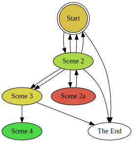

My Scrivener template for Twine 2 stories, [Scree](/tools/scree), doesn't give you a graphical layout of your story.  Neither Scrivener nor Twine 2 support auto-layout of your story nodes into a graph.  (Composing a story entirely in Twine gives you a manual layout of the story.)  But something does support auto-layout of a directed graph: [Graphviz](http://www.graphviz.org).  So I made a Twine 2 proofing format that uses a [JavaScript implementation](https://github.com/mdaines/viz.js/) of Graphviz to lay out your story nodes as a graph.  The current version also can color nodes according to their length or their tags, mark interesting nodes (missing nodes, end nodes, and checkpoints), omit node names, cluster by tags, and rotate or shrink the graph.

Note that DotGraph may fail to draw the graph in some versions of Twine 2 due to issues with Chrome; in that case it will still give you the text of the dot source file, as well as some links to sites online that will render it for you.  (I recommend using [the online version of Twine 2](https://twinery.org/2/) with DotGraph.)

Twine 1 stories are not supported yet.

### Installation

To add DotGraph to Twine 2, use this URL (under Formats > Add a New Format): `https://mcdemarco.net/tools/scree/dotgraph/format.js`    
You may also want to click the star next to DotGraph in the Proofing Formats list (also under Formats) to make it your default proofing format.

Next, import your story (if it isn't already in Twine 2), click on it to open it, and click View Proofing Copy in the popup menu in the lower left hand corner of the UI.

You can also use the dotgraph format with an external Twine 2 renderer like [Twee2](http://twee2.danq.me); just download [format.js](/tools/scree/dotgraph/format.js) to your filesystem and follow the instructions for your renderer.

### Versions

This is the archive of version 1.1.4, which included various graph configuration options and editing of the dotgraph source.

#### Previous Versions

* [Version 1.1.3](/tools/scree/dotgraph/1.1.3/format.js): Included highlighting of terminal nodes, and special highlighting for the tag "End".

* [Version 1.1.2](/tools/scree/dotgraph/1.1.2/format.js): Included clustering on tags.  It uses only one tag per passage due to Graphviz restrictions (clusters cannot overlap).

* [Version 1.1.1](/tools/scree/dotgraph/1.1.1/format.js): Produced graphs colored by node length, with detection of missing nodes, and better detection of the start node.

* [Version 1.1.0](/tools/scree/dotgraph/1.1.0/format.js): Produced black-and-white graphs, with poor detection of the start node.

### Examples

Here's a bigger rendition of the proofing format's icon, which is a simplified version of the graph for my Scree example story:

I use clustering on tags with Scrivener labels, which are one-per-passage anyway.  You can get your Scrivener labels into your twee tags by adding ` [<$label>]` to the beginning of the title suffix for each text document level under Compile > All Options > Formatting > Section Layout button.  See the placeholder list under Help for other variables you might want to put there, but beware of anything with spaces in it, like the default "No Label" and "No Status" label and status, respectively.  You can edit those in Scrivener if necessary, even to the empty string.

### Sausage

I described the issue with Chrome [in the Twine forum](https://twinery.org/forum/discussion/7879/a-proofing-format-using-graphviz-and-a-chrome-issue).
