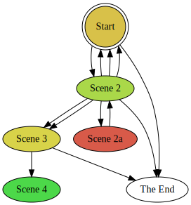

DotGraph is a proofing format that uses a [JavaScript implementation](https://github.com/mdaines/viz.js/) of [Graphviz](http://www.graphviz.org) to automatically lay out a [Twine](https://twinery.org/) story as a layered graph.  (For more about this and other styles of story graphs, see [A History of Choice Mapping](/blog/2017/10/27/history-of-choice-mapping/)).

DotGraph works with Twine 1, [Twine 2](https://twinery.org/2/), Twee, [Twee2](https://dan-q.github.io/twee2/), and [TweeGo](http://www.motoslave.net/tweego/).  It can color nodes according to their length or their tags, mark interesting nodes (missing nodes, end nodes, and checkpoints), omit node names, cluster by tags, skip special and/or specially tagged passages, skip display links, and rotate or shrink the graph.  It also shows you some basic story statistics.

### DotGraph as a Service

Fill in the URL of a Twine story here to have DotGraph graph it:

<input type="text" id="dgaas" size="50"/>&nbsp;<a href="" onclick="this.setAttribute('href', '/tools/scree/dotgraph/dgaas.html?' + document.getElementById('dgaas').value);">Graph It!</a>

(This service uses a beta version of DotGraph 2.2.0.  It can follow philome.la and some itch.io links without pressing the PLAY button or popping out of the iframe, respectively.)

### Versions

The current version of DotGraph is 2.1.0, which adds a text tracing option and support for configuration using the StorySettings passage.  Previous versions are archived [here](/tools/scree/dotgraph/versions.html).

Each version of DotGraph comes in four forms, Twine 1 or Twine 2, and offline or online.  (Twine 2 is not fully backwards compatible with Twine 1; in particular their story formats always differ.)

The offline versions package the entire Graphviz renderer in the head of the DotGraph output file, making it large but freestanding.  The online versions fetch the Graphviz renderer from this website whenever you open them, meaning that an internet connection is required when using them, but the file may be also be cached, making your output file load faster if you run DotGraph frequently.  In some cases you can only use the offline version; see the installation and sausage sections for more details.

### Installation

#### Twine 2

To add DotGraph to [the online version of Twine 2](https://twinery.org/2/), use this URL (under Formats > Add a New Format): `https://mcdemarco.net/tools/scree/dotgraph/format.js`    

To add DotGraph to the installable local versions of Twine 2, follow the installation instructions for online use, but use the following "offline" URL:  `https://mcdemarco.net/tools/scree/dotgraph/offline/format.js`    

#### Twine 1

To add DotGraph to Twine 1, create a new folder called `dotgraph` inside your targets folder, then download [this file](https://mcdemarco.net/tools/scree/dotgraph/header.html): `https://mcdemarco.net/tools/scree/dotgraph/header.html` and place it inside the `dotgraph` folder.  For offline use, download and use [this file](https://mcdemarco.net/tools/scree/dotgraph/offline/header.html) instead: `https://mcdemarco.net/tools/scree/dotgraph/offline/header.html`

See the [Twine wiki](http://twinery.org/wiki/twine1:story_format#adding_formats) for more information about installing and using story formats in Twine 1.

### Use

#### Twine 2

After installation, you may want to click the star or radio button next to DotGraph in the Proofing Formats list (also under Formats) to make it your default proofing format.

Next, import your story (if it isn't already in Twine 2), click on it to open it, and click View Proofing Copy in the popup menu in the lower left hand corner of the UI.

#### Twine 1

In Twine 1, open or create a story (under the File menu).  Then, in the Story menu under Story Formats, select DotGraph as the story format.  Choose Test Play or Build Story from the Build menu to see your story.  (You may need to restart Twine 1 if you installed DotGraph while it was still running.)

#### Twees

You can also use DotGraph with an external Twine renderer like Twee or [Twee2](http://twee2.danq.me); just download the appropriate file (`format.js` or `header.html`, depending on the associated Twine version) to your filesystem and follow your renderer's instructions for installing and using a new story format.

#### Settings

As a story format, DotGraph outputs an HTML file that contains the DotGraph controls, the graph of your story, and the dot source code of the graph.  It will look like this:

(The dot source is not pictured in the screenshot.)

As you change the settings (for tag color, graph direction, etc.), the graph and source code will be re-rendered live.  You can save the image (SVG) and/or the source file.
You can also edit the dot source manually and re-render the altered graph.

Instead of adjusting settings in the UI, you can pass in your desired settings (including some settings not available in the UI) using the StorySettings special passage.  They should be in the following (JSON) format:

    dotgraph:{"color":"length","scale":true,"ends":true,"trace":"Mars"}  

You only need pass in your desired changes; here's the full set of settings for reference (except the tag palette has been shortened for clarity):

    dotgraph:{"checkpoint":true,"checkpointTag":"checkpoint","cluster":false,
		"color":"length","countWords":true,"display":true,"ends":true,"endTag":"End",
		"lastTag":false,"omitSpecialPassages":true,"omitTags":[],"renumber":false,
		"rotation":"TB","scale":true,"showNodeNames":false,"trace":"",
		"palette":["#FEAF16","#2ED9FF","#DEA0FD","#FE00FA","#F7E1A0","#16FF32"]}

Though the configuration is displayed here on multiple lines, you should put it all on one line in your StorySettings file.

### Examples

Sean Michael Ragan graphed a classic story, [Chimney Rock](http://www.seanmichaelragan.com/html/%5B2008-03-07%5D_Choose_Your_Own_Adventure_book_as_directed_graph.shtml), in the Graphviz dot style long before DotGraph.

DotGraph's Twine 2 icon (which appears in the proofing format list after you install DotGraph) shows a simplified version of the graph of my [Scree](/tools/scree/) example story.  Here it is, larger than life:

Below is the graph of a longer, incomplete story with renumbered passages, end tags, and coloring by passage length.  

### Sausage

I described an issue with Chrome [in the old Twine forum](https://twinery.org/forum/discussion/7879/a-proofing-format-using-graphviz-and-a-chrome-issue).  This is why the offline mode is not only for running offline.

The source code is available [at BitBucket](https://bitbucket.org/mcdemarco/dotgraph).

DotGraph does not support Internet Explorer 8, but any newer browser should work.

I made DotGraph because my Scrivener template for Twine 2 stories, [Scree](/tools/scree), doesn't give you a graphical layout of your story, and neither Scree/Scrivener nor Twine 2 support auto-layout of your story nodes into a graph, but Graphviz does.  (Composing a story entirely in Twine gives you a manual layout of the story.)

I use coloring and/or clustering on the tags created from my Scrivener labels, which are one-per-passage anyway.  The latest version of  [Scree](/tools/scree/) automatically converts your Scrivener labels and statuses into Twine tags when you use the Twee2 compile option.  (It adds ` [<$label> <$status>]` to the beginning of the title suffix for each text document level under Compile > All Options > Formatting > Section Layout button.  See the placeholder list under Help for other variables you might want to put there, but beware of anything with spaces in it, like the default "No Label" and "No Status" label and status, respectively.  You can edit those in Scrivener if necessary, even to the empty string.)
