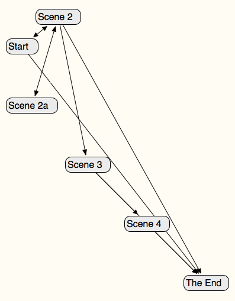

DotScap is a proofing format that lays out a [Twine](https://twinery.org/) story as a  [Scapple](https://www.literatureandlatte.com/scapple/overview) mind map.  For other styles of story graphs, see [DotGraph](/tools/scree/dotgraph/) and/or [A History of Choice Mapping](/blog/2017/10/27/history-of-choice-mapping/).

DotScap works with Twine 1, [Twine 2](https://twinery.org/2/), Twee, [Twee2](https://dan-q.github.io/twee2/), and [TweeGo](http://www.motoslave.net/tweego/).  It can omit node names, skip special and/or specially tagged passages, and skip display links.  It also shows you some basic story statistics.

### Versions

This is an archived version of DotScap is 1.0.0.  It was pretty preliminary, sketchy, and minorly buggy.

### Installation

#### Twine 2

To add DotScap to [Twine 2](https://twinery.org/2/), use this URL (under Formats > Add a New Format): `https://mcdemarco.net/tools/scree/dotscap/format.js`    

#### Twine 1

To add DotScap to Twine 1, create a new folder called `dotscap` inside your targets folder, then download this file: [https://mcdemarco.net/tools/scree/dotscap/header.html](https://mcdemarco.net/tools/scree/dotscap/header.html) and place it inside the `dotscap` folder.  See the [Twine wiki](http://twinery.org/wiki/twine1:story_format#adding_formats) for more information about installing and using story formats in Twine 1.

### Use

As a story format, DotScap outputs an HTML file that contains the DotScap controls and should automatically download the Scapple file for your story.  If you change the settings (for omissions, display links, etc.), you can click the Regenerate File button to download the revised Scapple file.

#### Twine 2

After installation, you may want to click the star or radio button next to DotScap in the Proofing Formats list (also under Formats) to make it your default proofing format.

Next, import your story (if it isn't already in Twine 2), click on it to open it, and click View Proofing Copy in the popup menu in the lower left hand corner of the UI.

#### Twine 1

In Twine 1, open or create a story (under the File menu).  Then, in the Story menu under Story Formats, select DotScap as the story format.  Choose Test Play or Build Story from the Build menu to see your story.  (You may need to restart Twine 1 if you installed DotScap while it was running.)

#### Twees

You can also use DotScap with an external Twine renderer like Twee, [Twee2](http://twee2.danq.me), or [TweeGo](https://www.motoslave.net/tweego/); just download the appropriate file (`format.js` or `header.html`, depending on the associated Twine version) to your filesystem and follow your renderer's instructions for installing and using a new story format.

#### Settings

You can adjust the settings in the UI, or you can pass in your desired settings (including some settings not available in the UI) using the StorySettings special passage.  They should be in the following (JSON) format:

    dotgraph:{"color":"length","scale":true,"ends":true,"trace":"Mars"}  

(That's not a typo; dotscap uses dotgraph's settings.)  You only need pass in your desired changes; see the [DotGraph documentation](/tools/scree/dotgraph/) for the full list of settings.

You should put the configuration on one line in your StorySettings file.

#### Examples

Here's a [Scapple file](/tools/scree/test-dotscap.scap) generated from the [Scree](/tools/scree/) example story.  (You may need to right-click the link to download it successfully.  If your browser appends a `.xml` to the file name, you may need to remove it before opening the file in Scapple.)

### Sausage

The source code is available [at BitBucket](https://bitbucket.org/mcdemarco/dotscap).

DotScap was inspired by a discussion on the [Twine discord server](https://discord.gg/n5dJvPp).

DotScap is in no way associated with Literature and Latte, the makers of Scapple.
