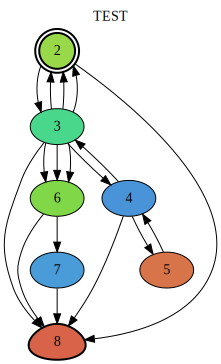

Scree is a gamebook template for [Scrivener 3](http://www.literatureandlatte.com/scrivener.php).  See the previous versions for Scrivener 1 and 2 support.

By default, when compiled in Scrivener (File > Compile), the template will generate a plain text file in "twee" format---a flat-file Markdown-like format for gamebooks---and then automatically post-process it into an HTML gamebook using [Twee2](http://twee2.danq.me) (a command-line Ruby gem) or [Tweego](https://www.motoslave.net/tweego/).  (Automatic post-processing requires the non-sandboxed, non-Mac App Store version of Scrivener 3 and one of Twee2 or Tweego; otherwise you can compile on the command line with any Twine command-line compiler.)

You can import the HTML file into the graphical gamebook editor [Twine](http://twinery.org) for further editing, use the twee file as part of a non-GUI workflow like [entwine](https://github.com/klembot/grunt-entwine-quickstart), or use Scree/Scrivener exclusively.

In the other direction, you can import an existing Twine or twee file into Scrivener, following the directions in the template.  It will be separated into scenes for you.  (If you have an old twee story, the format you probably want to use with it is SugarCube.)

Note that you should write purely in plain text, Markdown (including leaving blank lines in between paragraphs), or SugarCube's (non-Markdown) plain-text markup when using Scree; any rich text formatting will be ignored.  For more help with the Markdown-like dialects of the different story formats, or with gamebook scripting, see the story format documentation in the [Twine wiki](https://twinery.org/wiki/).

The name of the template within Scrivener is now Scree3 (under the Fiction templates); this is to allow you to run Scrivener 2 (with Scree) and Scrivener 3 (with Scree3) in parallel.  For more information about Scree, read [the instructions](ScreeFormat.html) (also included in the template).

You may also be interested in visualizing your story with [DotGraph](/tools/scree/dotgraph/) or [DotScap](/tools/scree/dotscap/), or post-processing it with [PrePub](/tools/scree/prepub/).

### Versions

The current version is 3.0.3, which supports Scrivener 3 (and requires at least version 3.0.3 of Scrivener).  At the time of writing, Scrivener 3 for Windows was not yet out and so has not been tested. 

[Download the Scree template](Scree.zip).

#### Previous Versions

The previous versions supported Scrivener 2 for Mac and Scrivener 1 and 2 for Windows.

* [Version 1.0.2](/tools/scree/1.0.2/): Included tag support (Scrivener tags and statuses are turned into Twine tags) and improved layout auto-generation for Twine 2.
* [Version 1.0.1](/tools/scree/1.0.1/): Included some missing support files for Scrivener 1 for Windows.
* [Version 1.0](/tools/scree/1.0/): Accidentally only supported Scrivener 2.x for MacOSX.

### Examples

The template comes pre-populated with a few scenes.  Here is how they look after compiling in Scrivener, but before compiling with Twee2 or Tweego:

* [Twee2 output](test-twee2.tw) from Scrivener using (default) compile option Twee2
* [Twee output](test-twee.tw) using the Twee compile option

Here are various versions of the final gamebook, compiled from the Scrivener output above using the Twine 2 story formats supported by Twee2 plus some of my own formats:

* [Using Harlowe](test.html), the default Twine 2 format
* [Using Snowman](test-snowman.html)
* [Using SugarCube](test-sugarcube.html)
* [Using SugarCube2](test-sugarcube2.html)
* [Using PaperThin](test-paperthin.html), a format for proofreading or word-counting.  Note that PaperThin is still an HTML format; you can save it as text from a browser to get plain text, or just proofread and/or wordcount using the twee source file instead.
* Using [Paloma](/tools/scree/paloma/), a Jonah-like format for Twine 2: [test-paloma.html](test-paloma.html)
* Using [PrePub](/tools/scree/prepub/), an ePub format generated with [pandoc](https://pandoc.org): [ePub](test-prepub.epub), [Markdown source file](test-prepub.md)
* Mapped with [DotScap](/tools/scree/dotscap/), a set of tools for mind-mapping your story with [Scapple](https://www.literatureandlatte.com/scapple/overview):  [Scapple file](test-dotscap.scap).  (Note that you need Scapple to view this; there's a free trial, or you can see an example on [the DotScap page](/tools/scree/dotscap/).)
* Mapped with [DotGraph](/tools/scree/dotgraph/), a story format for graphing your story: 

### Sausage

I shared a few implementation details [in the blog](/blog/2016/10/20/scree/) and the [Twine forum](https://twinery.org/forum/discussion/7474/using-external-ide).

If you're still on Scrivener 2, you might also want to have a look at my blog post about [automating Scrivener](/blog/2017/10/08/autoscrivener/).  For other questions, check out my [other Scrivener posts](/blog/tags/Scrivener/) and/or my [other hyperfiction posts](/blog/tags/hyperfiction/).
